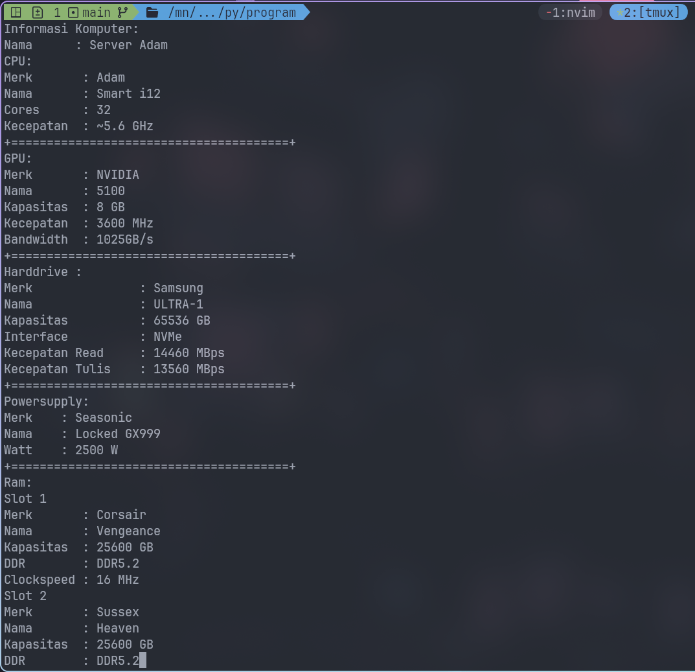
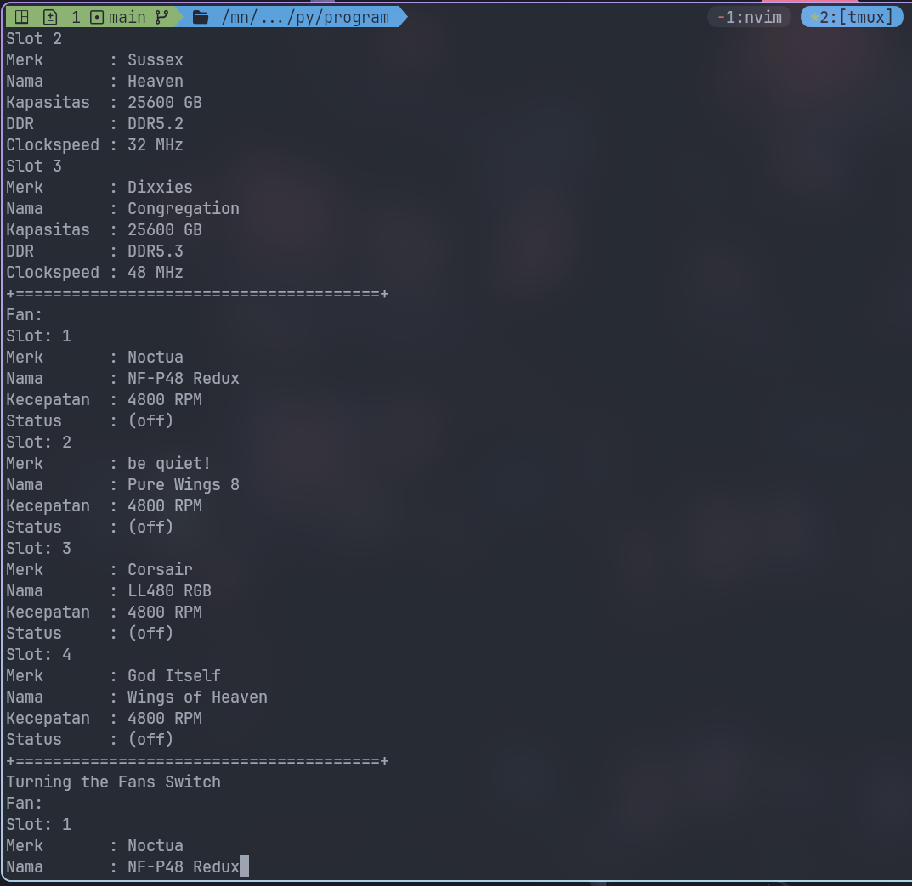
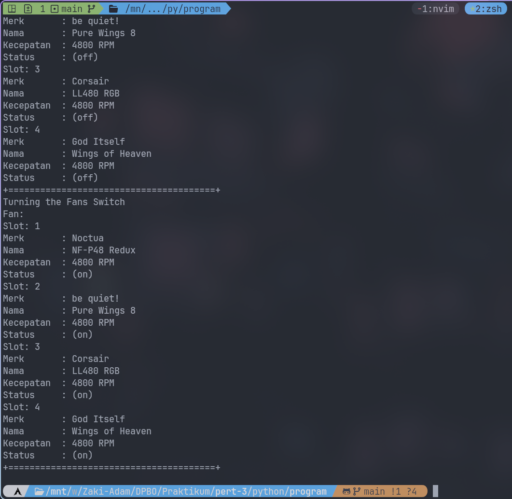

# TP3DPBO2025C2
Saya Zaki Adam dengan NIM 2304934 mengerjakan Tugas Praktikum 3 dalam mata kuliah Desain dan Pemrograman Berorientasi Objek untuk Keberkahan-Nya maka saya tidak akan melakukan kecurangan seperti yang telah dispesifikasikan. Aamiin.

## Diagram Desain

## Desain Program
### Komponen
#### Overview
Merupakan class yang mendeskripsikan perangkat keras
#### Attributes
* Merk: Merk perangkat keras tersebut
* Nama: Nama jenis/model perangkat keras tersebut
#### Methods
* Getter: Mengambil value dari class tersebut. Berlaku untuk attribut Merk dan Nama
* Setter: Memodifikasi value dari class tersebut. Berlaku untuk attribut Merk dan Nama
---
### Memory
#### Overview
Merupakan class yang mendeskripsikan ukuran penyimpanan untuk primary storage dan juga mendeskripsikan kecepatan frekuensi atau clockspeed perangkat tersebut
#### Attributes
* kapasitasGB: Ukuran penyimpanan dari perangkat tersebut.
* kecepatanMHz: Kecepatan frekuensi dari perangkat tersebut.
#### Methods
* Getter: Mengambil value dari class tersebut. Berlaku untuk attribut kapasitasGB dan kecepatanMHz
* Setter: Memodifikasi value dari class tersebut. Berlaku untuk attribut kapasitasGB dan kecepatanMHz
---
### CPU
#### Overview
Merupakan class yang mendeskripsikan Central Processing Unit dari sebuah Komputer. Class ini merupakan subclass dari Komponen.
#### Attributes
* JumlahCore: Jumlah core dalam perangkat CPU tersebut.
* KecepatanGHz: Kecepatan process/frekuensi dari CPU tersebut.
#### Methods
* Getter: Mengambil value dari class tersebut. Berlaku untuk attribut JumlahCore dan KecepatanGHz
* Setter: Memodifikasi value dari class tersebut. Berlaku untuk attribut JumlahCore dan KecepatanGHz
---
### GPU
#### Overview
Merupakan class yang mendeskripsikan Graphics Processing Unit dari sebuah Komputer. Class ini merupakan subclass dari Komponen (untuk mendeskripsikan asal/merk perangkat tersebut) dan Memory (untuk mendeskripsikan kapasitas dari Memorynya).
#### Attributes
* Gddr: Jenis GDDR dari GPUnya (i.e. GDDR5, GDDR6)
* Bandwidth: Kecepatan memory GPU untuk membaca dan menulis data.
#### Methods
* Getter: Mengambil value dari class tersebut. Berlaku untuk attribut Gddr dan Bandwidth
* Setter: Memodifikasi value dari class tersebut. Berlaku untuk attribut Gddr dan Bandwidth
---
### RAM
#### Overview
Merupakan class yang mendeskripsikan Random Access Memory (RAM) dari sebuah komputer. Class ini merupakan subclass dari Komponen (untuk mendeskripsikan asal/merk perangkat tersebut) dan Memory (untuk mendeskripsikan kapasitas dari Memorynya).
#### Attributes
* ddr: Jenis DDR dari RAM (i.e. DDR3, DDR4, DDR5).
#### Methods
* Getter: Mengambil value dari atribut ddr.
* Setter: Memodifikasi value dari atribut ddr.
---
### Harddrive
#### Overview
Merupakan class yang mendeskripsikan perangkat penyimpanan sekunder (Hard Drive) dari sebuah komputer. Class ini merupakan subclass dari Komponen.
#### Attributes
* kapasitasGB: Kapasitas penyimpanan dalam GB.
* kecepatanBacaMBps: Kecepatan baca dalam MB/s.
* kecepatanTulisMBps: Kecepatan tulis dalam MB/s.
* interface: Jenis interface yang digunakan (i.e. SATA, NVMe, USB).
#### Methods
* Getter: Mengambil value dari atribut kapasitasGB, kecepatanBacaMBps, kecepatanTulisMBps, dan interface.
* Setter: Memodifikasi value dari atribut kapasitasGB, kecepatanBacaMBps, kecepatanTulisMBps, dan interface.
---
### PowerSupply
#### Overview
Merupakan class yang mendeskripsikan unit power supply dari sebuah komputer. Class ini merupakan subclass dari Komponen.
#### Attributes
* Watt: Kapasitas daya yang dapat diberikan oleh power supply dalam satuan watt.
#### Methods
* Getter: Mengambil value dari atribut Watt.
* Setter: Memodifikasi value dari atribut Watt.
---
### Fan (Kipas)
#### Overview
Merupakan class yang mendeskripsikan kipas pendingin dalam sistem komputer.
#### Attributes
* Kecepatan: Kecepatan kipas dalam RPM (Rotations Per Minute).
* Status: Status kipas (i.e. ON/OFF).
#### Methods
* Getter: Mengambil value dari atribut Kecepatan dan Status.
* Setter: Memodifikasi value dari atribut Kecepatan dan Status.
---
### Komputer
#### Overview
Merupakan class utama yang merepresentasikan sebuah komputer, yang terdiri dari berbagai komponen seperti CPU, GPU, RAM, Harddrive, Kipas, dan PowerSupply. Komputer memiliki hubungan composition (has a) dengan perangkat yang telah disebut di atas. Untuk lebih spesifiknya:
* Komputer memiliki satu CPU, GPU, Harddrive, dan PowerSupply.
* Komputer bisa memiliki lebih dari satu atau n untuk RAM dan Fan.
#### Attributes
* nama: Nama atau identifikasi komputer.
#### Methods
* Getter: Mengambil value dari atribut nama.
* Setter: Memodifikasi value dari atribut nama.
* TurnSwitchKipas(): Method untuk menyalakan atau mematikan kipas dalam sistem komputer.
## Penjelasan Alur
1. Inisialisasi objek perangkat keras Komputer
* Membuat komponen-komponen seperti CPU, RAM, Harddrive, Kipas
2. Menginisiasi objek Komputer.
* Dapat mengambil dari Komponen yang sebelumnya sudah dibuat, ataupun langsung dibuat dalam parameter Komputer.
3. Menampilkan Informasi Komputer
* Pemilik, CPU, GPU, Harddrive, dan Powersupply
* Menampilkan RAM apa saja yang terinstall dalam komputer
* Menampilkan kondisi Kipas-Kipas dalam Komputer yang mati sekarang
4. Mengaktifkan Kipas Komputer
* Menampilkan kondisi Kipas-Kipas dalam Komputer yang menyala sekarang
## Dokumentasi
contoh dalam bentuk python

